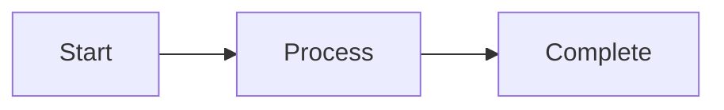

Hello, this is LISA! 🙂

"I need to put diagrams in the design document..."

The old me:
- Open PowerPoint
- Draw shapes
- Place arrows
- Choose colors
- Align
- 30 minutes pass... 😅

**I had the fixed idea that "I need to directly make images or PDFs".**

But as I mentioned in [the first post]({{ site.baseurl }}), **when made with Mermaid + AI tools, the quality is beyond expectations**!

Today I'll share how I actually used it to **streamline team communication**.

## What is Mermaid?

**It's a tool for drawing diagrams with text.**

### Simple Example

**Write this:**


**Shows like this:**
Start → Process → Complete (box shapes connected with arrows)

### Why is it Good?

✅ **Version control**: Track history with Git
✅ **Easy modification**: Just fix the text
✅ **Consistency**: Styles automatically applied
✅ **Collaboration**: Can review diagrams like code review
✅ **AI-friendly**: Claude Code can generate immediately

### Want to Know Detailed Syntax?

The Mermaid official documentation has all diagram types and syntax in detail:
- **Official docs**: https://mermaid.js.org/
- **Live editor**: https://mermaid.live/

But **I didn't need to memorize syntax or look up manuals.** Because...

## Combination with AI Tools is a Game Changer

### Old Way (Study Syntax)

1. Open Mermaid documentation
2. Find desired diagram type
3. Read and understand syntax
4. Write code directly
5. If error, check documentation again
6. Modify and retry

**Time**: 20-30 minutes (including time to learn syntax)

### Using AI Tools (Now)

**To Claude Code:**
> "Make login process sequence diagram.
> User → Web → API → DB order"

**Result:**
→ Mermaid code generated in seconds
→ Immediate visualization
→ If modification needed, just say "Add Redis caching"

**Time**: 1-2 minutes

**Don't need to know syntax!** AI does it all.

## How I Use It in Actual Work

### Situation 1: Requirements Analysis Meeting

**Before:**
- Planner: "It would be easier to understand with a use case diagram..."
- Me: "I'll draw and share after the meeting" (30 minutes later...)

**Now:**
- Planner: "It would be easier with a use case diagram..."
- Me: *Open Claude Code, 1 minute* "How about this?" (share immediately in meeting)

**Effect:**
- ✅ Immediate visualization during meeting
- ✅ Get feedback and modify right away
- ✅ Document complete when meeting ends

### Situation 2: Design Review

**Before:**
- "How will you implement this feature?"
- Explain verbally... (different understanding)
- "Oh, I'll draw in PowerPoint and share"
- Next day...

**Now:**
- "How will you implement this feature?"
- *Request sequence diagram from Claude Code, 1 minute*
- "Like this" (share immediately)
- Discussion complete on the spot

**Effect:**
- ✅ Immediate feedback
- ✅ Reduced misunderstandings
- ✅ Faster decision-making

### Situation 3: PR Review

**Before:**
```markdown
## Changes
- Refactored login process
- Improved session management

(Long explanation...)
```

**Now:**
```markdown
## Changes
- Refactored login process

## Architecture
[Sequence diagram - Before]
[Sequence diagram - After]

Can see at a glance, right?
```

**Effect:**
- ✅ Reviewer understands quickly
- ✅ Reduced review time
- ✅ Better feedback

## Practical Application: By Diagram Type

### 1. Sequence Diagrams (Most Used)

**When to use?**
- API design discussion
- Process explanation
- Error handling flow
- Performance optimization discussion

**To Claude Code:**
> "Make order process sequence diagram.
> Include inventory check, payment, shipping steps"

→ Completed in 1 minute
→ Use immediately in meeting

**Actual Effect:**
- Planner: "Oh, what happens if payment fails?"
- Me: "Add error handling to diagram" (updated in 10 seconds)
- Everyone: "Ah! Got it!"

### 2. State Diagrams

**When to use?**
- Explain complex state management
- Order/payment process
- UI state transitions

**To Claude Code:**
> "Make order state diagram.
> Order received → Payment → Shipping → Complete, also include cancel path"

→ Completed in 1 minute

**Actual Effect:**
- QA: "Until which stage can it be canceled?"
- While looking at diagram: "Up to here"
- Clearer than words!

### 3. Use Case Diagrams

**When to use?**
- Organize requirements
- Discuss feature scope
- Permission design

**To Claude Code:**
> "E-commerce system use case diagram.
> Actor: Customer, Administrator"

→ Completed in 1 minute

### 4. Architecture Diagrams

**When to use?**
- Explain system structure
- Share tech stack
- New employee onboarding

**To Claude Code:**
> "Our system architecture diagram.
> Frontend(React), Backend(Node.js), DB(PostgreSQL)"

→ Completed in 1 minute

## Using CLAUDE.md from [Previous Post]({{ site.baseurl }})

### Define Mermaid Style Guide

```markdown
# CLAUDE.md

## Mermaid Diagram Guidelines

### Sequence Diagrams
- Participant names: Use Korean
- Arrows: Request(->>), Response(-->>)
- Express only major steps (5-10 steps goal)

### State Diagrams
- State names: Korean noun form
- Transition conditions: Clear and concise

### Common Rules
- If complex, split into multiple diagrams
- Minimize comments
- Express only core flow
```

With this setup, diagrams come out in **consistent style**.

## Things Learned in Practice

### ✅ Use Like This

**1. Don't Prepare Diagrams Before Meetings**

I used to draw diagrams before meetings, but everything changed during meetings 😅

Now:
- Make when needed during meetings
- Modify while getting feedback on the spot
- Final version complete when meeting ends

**2. Include Diagrams in PRs**

```markdown
## Architecture Changes
Before:
[Diagram]

After:
[Diagram]
```

Reviewers understand in 5 seconds.

**3. Version Control with Documents**

```bash
docs/
├── architecture.md
└── diagrams/
    ├── login-sequence.mmd
    └── order-state.mmd
```

- Save as .mmd files, not images
- Track change history with Git
- Modify again when needed

**4. Reuse Templates**

```markdown
# .claude/templates/sequence-basic.mmd

sequenceDiagram
    participant User
    participant System

    User->>System: Request
    System-->>User: Response
```

If you make templates for frequently used structures, Claude Code will create based on them.

### ❌ Don't Do This

**1. Too Complex**

```
❌ Include all steps (20-step sequence)
✅ Only core flow (5-7 steps)
```

If complex, split into multiple diagrams.

**2. Save as Image**

```
❌ diagram.png
✅ diagram.mmd
```

Text files allow version control and easier modification.

**3. Try to Study Syntax**

Just ask AI. No need to memorize syntax!

## Breaking Fixed Ideas

**Before:**
"Diagrams = Take a lot of time = Only for important documents"

**Now:**
"Diagrams = Done in 1 minute = Use daily"

- Diagrams even for simple questions
- Diagrams in chat
- Diagrams in PRs

**Visualization became standard**.

### Productivity Change

**Diagram creation time:**
- PowerPoint: 20-30 minutes
- Mermaid directly: 10-15 minutes
- AI + Mermaid: 1-2 minutes

**15x faster!**

**More importantly:**
- Immediate communication
- Reduced misunderstandings
- Better decision-making

## Series Summary

**Part 1**: Context pollution problem and Clear + CLAUDE.md solution
**Part 2**: CLAUDE.md management strategy and templates
**Part 3**: Streamlining communication with Mermaid

**Core Message:**
- Basics more important than latest features
- Context management is everything
- Explosive productivity with AI tools
- Tools are more powerful than you think

**Claude Code is now:**
- ✅ Code writing
- ✅ Design documents
- ✅ Diagrams
- ✅ Team communication

**A partner for all aspects of work**.

## Next Steps?

**Start Small:**

1. **In next meeting**: Try "Make sequence diagram"
2. **In next PR**: Include one diagram
3. **Share with colleagues**: "This was convenient"

**You'll naturally expand once you see the effect!**

And if you're curious about Mermaid syntax, check the official documentation (https://mermaid.js.org/). But mostly just ask AI!

## 📱 Actually Used in TipSmart

When developing TipSmart, I made diagrams for all major features:
- Tip calculation process (sequence)
- App state management (state diagram)
- MVVM architecture (component diagram)

Meeting time cut in half, team understanding much improved.

**[Download TipSmart from App Store](https://apps.apple.com/app/tipsmart-tip-calculator/id6749946714)** 📱

---

*Will you try Mermaid + AI now?*
*Just try it once in your next meeting. You'll feel it immediately!*

*Completed the 3-part series after a month and a half.*
*Thank you so much for reading the long posts!* 🙏
