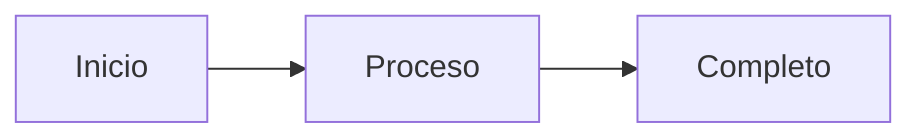

¡Hola, soy LISA! 🙂

"Necesito poner diagramas en el documento de diseño..."

La vieja yo:
- Abrir PowerPoint
- Dibujar formas
- Colocar flechas
- Elegir colores
- Alinear
- 30 minutos pasan... 😅

**Tenía la idea fija de que "necesito hacer directamente imágenes o PDFs".**

Pero como mencioné en [la primera publicación]({{ site.baseurl }}), **¡cuando se hace con Mermaid + herramientas de IA, la calidad está más allá de las expectativas!**

Hoy compartiré cómo realmente lo usé para **optimizar la comunicación del equipo**.

## ¿Qué es Mermaid?

**Es una herramienta para dibujar diagramas con texto.**

### Ejemplo Simple

**Escribe esto:**


**Se muestra así:**
Inicio → Proceso → Completo (formas de caja conectadas con flechas)

### ¿Por Qué es Bueno?

✅ **Control de versiones**: Rastrear historial con Git
✅ **Modificación fácil**: Solo corregir el texto
✅ **Consistencia**: Estilos aplicados automáticamente
✅ **Colaboración**: Puede revisar diagramas como revisión de código
✅ **Amigable con IA**: Claude Code puede generar inmediatamente

### ¿Quieres Saber la Sintaxis Detallada?

La documentación oficial de Mermaid tiene todos los tipos de diagramas y sintaxis en detalle:
- **Documentación oficial**: https://mermaid.js.org/
- **Editor en vivo**: https://mermaid.live/

Pero **no necesité memorizar sintaxis o buscar manuales.** Porque...

## La Combinación con Herramientas de IA es un Cambio de Juego

### Manera Antigua (Estudiar Sintaxis)

1. Abrir documentación de Mermaid
2. Encontrar tipo de diagrama deseado
3. Leer y entender sintaxis
4. Escribir código directamente
5. Si hay error, revisar documentación de nuevo
6. Modificar y reintentar

**Tiempo**: 20-30 minutos (incluyendo tiempo para aprender sintaxis)

### Usando Herramientas de IA (Ahora)

**A Claude Code:**
> "Haz diagrama de secuencia del proceso de inicio de sesión.
> Orden Usuario → Web → API → DB"

**Resultado:**
→ Código Mermaid generado en segundos
→ Visualización inmediata
→ Si se necesita modificación, solo di "Agrega caché Redis"

**Tiempo**: 1-2 minutos

**¡No necesitas conocer la sintaxis!** La IA lo hace todo.

## Cómo Lo Uso en el Trabajo Real

### Situación 1: Reunión de Análisis de Requisitos

**Antes:**
- Planificador: "Sería más fácil de entender con un diagrama de casos de uso..."
- Yo: "Dibujaré y compartiré después de la reunión" (30 minutos después...)

**Ahora:**
- Planificador: "Sería más fácil con un diagrama de casos de uso..."
- Yo: *Abrir Claude Code, 1 minuto* "¿Qué tal esto?" (compartir inmediatamente en reunión)

**Efecto:**
- ✅ Visualización inmediata durante la reunión
- ✅ Obtener retroalimentación y modificar de inmediato
- ✅ Documento completo cuando termina la reunión

### Situación 2: Revisión de Diseño

**Antes:**
- "¿Cómo implementarás esta función?"
- Explicar verbalmente... (diferente comprensión)
- "Oh, dibujaré en PowerPoint y compartiré"
- Al día siguiente...

**Ahora:**
- "¿Cómo implementarás esta función?"
- *Solicitar diagrama de secuencia de Claude Code, 1 minuto*
- "Así" (compartir inmediatamente)
- Discusión completa en el momento

**Efecto:**
- ✅ Retroalimentación inmediata
- ✅ Malentendidos reducidos
- ✅ Toma de decisiones más rápida

### Situación 3: Revisión de PR

**Antes:**
```markdown
## Cambios
- Refactorizado proceso de inicio de sesión
- Mejorada gestión de sesión

(Larga explicación...)
```

**Ahora:**
```markdown
## Cambios
- Refactorizado proceso de inicio de sesión

## Arquitectura
[Diagrama de secuencia - Antes]
[Diagrama de secuencia - Después]

Se puede ver de un vistazo, ¿verdad?
```

**Efecto:**
- ✅ El revisor entiende rápidamente
- ✅ Tiempo de revisión reducido
- ✅ Mejor retroalimentación

## Aplicación Práctica: Por Tipo de Diagrama

### 1. Diagramas de Secuencia (Más Usados)

**¿Cuándo usar?**
- Discusión de diseño de API
- Explicación de proceso
- Flujo de manejo de errores
- Discusión de optimización de rendimiento

**A Claude Code:**
> "Haz diagrama de secuencia del proceso de pedido.
> Incluye pasos de verificación de inventario, pago, envío"

→ Completado en 1 minuto
→ Usar inmediatamente en reunión

**Efecto Real:**
- Planificador: "¿Qué pasa si falla el pago?"
- Yo: "Agregar manejo de errores al diagrama" (actualizado en 10 segundos)
- Todos: "¡Ah! ¡Entendido!"

### 2. Diagramas de Estado

**¿Cuándo usar?**
- Explicar gestión de estado compleja
- Proceso de pedido/pago
- Transiciones de estado de UI

**A Claude Code:**
> "Haz diagrama de estado de pedido.
> Pedido recibido → Pago → Envío → Completo, también incluye ruta de cancelación"

→ Completado en 1 minuto

**Efecto Real:**
- QA: "¿Hasta qué etapa se puede cancelar?"
- Mientras miran el diagrama: "Hasta aquí"
- ¡Más claro que palabras!

### 3. Diagramas de Casos de Uso

**¿Cuándo usar?**
- Organizar requisitos
- Discutir alcance de funciones
- Diseño de permisos

**A Claude Code:**
> "Diagrama de casos de uso del sistema de e-commerce.
> Actor: Cliente, Administrador"

→ Completado en 1 minuto

### 4. Diagramas de Arquitectura

**¿Cuándo usar?**
- Explicar estructura del sistema
- Compartir stack tecnológico
- Incorporación de nuevos empleados

**A Claude Code:**
> "Diagrama de arquitectura de nuestro sistema.
> Frontend(React), Backend(Node.js), DB(PostgreSQL)"

→ Completado en 1 minuto

## Usando CLAUDE.md de [Publicación Anterior]({{ site.baseurl }})

### Definir Guía de Estilo de Mermaid

```markdown
# CLAUDE.md

## Directrices de Diagramas Mermaid

### Diagramas de Secuencia
- Nombres de participantes: Usar coreano
- Flechas: Solicitud(->>), Respuesta(-->>)
- Expresar solo pasos principales (objetivo 5-10 pasos)

### Diagramas de Estado
- Nombres de estado: Forma sustantiva coreana
- Condiciones de transición: Claro y conciso

### Reglas Comunes
- Si es complejo, dividir en múltiples diagramas
- Minimizar comentarios
- Expresar solo flujo central
```

Con esta configuración, los diagramas salen en **estilo consistente**.

## Cosas Aprendidas en la Práctica

### ✅ Usa Así

**1. No Prepares Diagramas Antes de las Reuniones**

Solía dibujar diagramas antes de las reuniones, pero todo cambiaba durante las reuniones 😅

Ahora:
- Hacer cuando se necesite durante las reuniones
- Modificar mientras se recibe retroalimentación en el momento
- Versión final completa cuando termina la reunión

**2. Incluir Diagramas en PRs**

```markdown
## Cambios de Arquitectura
Antes:
[Diagrama]

Después:
[Diagrama]
```

Los revisores entienden en 5 segundos.

**3. Control de Versiones con Documentos**

```bash
docs/
├── architecture.md
└── diagrams/
    ├── login-sequence.mmd
    └── order-state.mmd
```

- Guardar como archivos .mmd, no imágenes
- Rastrear historial de cambios con Git
- Modificar de nuevo cuando sea necesario

**4. Reutilizar Plantillas**

```markdown
# .claude/templates/sequence-basic.mmd

sequenceDiagram
    participant User
    participant System

    User->>System: Solicitud
    System-->>User: Respuesta
```

Si haces plantillas para estructuras usadas frecuentemente, Claude Code creará basándose en ellas.

### ❌ No Hagas Esto

**1. Demasiado Complejo**

```
❌ Incluir todos los pasos (secuencia de 20 pasos)
✅ Solo flujo central (5-7 pasos)
```

Si es complejo, dividir en múltiples diagramas.

**2. Guardar como Imagen**

```
❌ diagram.png
✅ diagram.mmd
```

Los archivos de texto permiten control de versiones y modificación más fácil.

**3. Intentar Estudiar Sintaxis**

¡Solo pregunta a la IA. No necesitas memorizar sintaxis!

## Rompiendo Ideas Fijas

**Antes:**
"Diagramas = Toman mucho tiempo = Solo para documentos importantes"

**Ahora:**
"Diagramas = Hecho en 1 minuto = Usar diariamente"

- Diagramas incluso para preguntas simples
- Diagramas en chat
- Diagramas en PRs

**La visualización se convirtió en estándar**.

### Cambio de Productividad

**Tiempo de creación de diagramas:**
- PowerPoint: 20-30 minutos
- Mermaid directamente: 10-15 minutos
- IA + Mermaid: 1-2 minutos

**¡15 veces más rápido!**

**Más importante:**
- Comunicación inmediata
- Malentendidos reducidos
- Mejor toma de decisiones

## Resumen de la Serie

**Parte 1**: Problema de contaminación del contexto y solución Clear + CLAUDE.md
**Parte 2**: Estrategia de gestión de CLAUDE.md y plantillas
**Parte 3**: Optimizando comunicación con Mermaid

**Mensaje Central:**
- Los fundamentos son más importantes que las últimas funciones
- La gestión del contexto lo es todo
- Productividad explosiva con herramientas de IA
- Las herramientas son más poderosas de lo que piensas

**Claude Code es ahora:**
- ✅ Escritura de código
- ✅ Documentos de diseño
- ✅ Diagramas
- ✅ Comunicación del equipo

**Un socio para todos los aspectos del trabajo**.

## ¿Próximos Pasos?

**Comienza Pequeño:**

1. **En la próxima reunión**: Intenta "Haz diagrama de secuencia"
2. **En el próximo PR**: Incluye un diagrama
3. **Comparte con colegas**: "Esto fue conveniente"

**¡Expandirás naturalmente una vez que veas el efecto!**

Y si tienes curiosidad sobre la sintaxis de Mermaid, consulta la documentación oficial (https://mermaid.js.org/). ¡Pero en su mayoría solo pregunta a la IA!

## 📱 Realmente Usado en TipSmart

Al desarrollar TipSmart, hice diagramas para todas las funciones principales:
- Proceso de cálculo de propina (secuencia)
- Gestión de estado de la app (diagrama de estado)
- Arquitectura MVVM (diagrama de componentes)

Tiempo de reunión reducido a la mitad, comprensión del equipo mucho mejorada.

**[Descargar TipSmart de App Store](https://apps.apple.com/app/tipsmart-tip-calculator/id6749946714)** 📱

---

*¿Probarás Mermaid + IA ahora?*
*Solo pruébalo una vez en tu próxima reunión. ¡Lo sentirás inmediatamente!*

*Completé la serie de 3 partes después de un mes y medio.*
*¡Muchas gracias por leer las largas publicaciones!* 🙏
